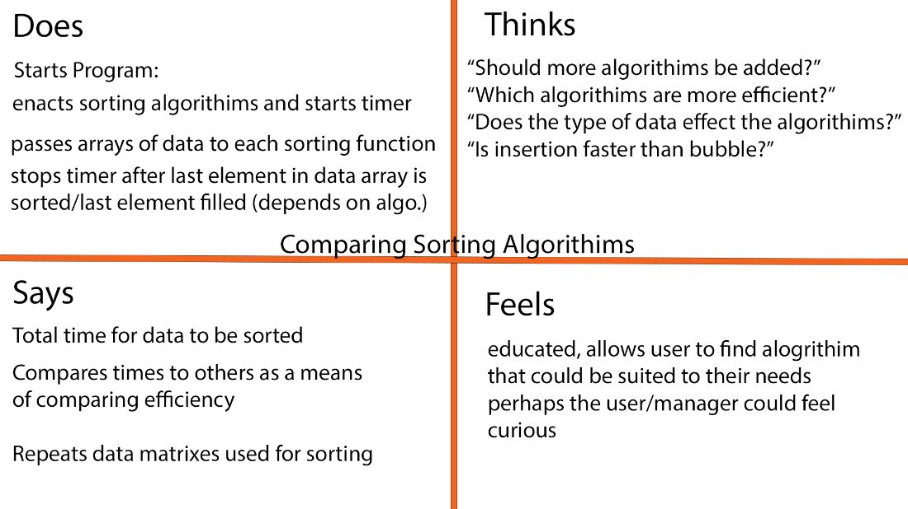

# COMP 3000- Semester Project
## Comparing Sorting Algorithms
### Description
There are many different ways to approach sorting data structures. The goal of this project is to collect data on the efficiency of different sorting algorithms and display them back to the end user.

### Empathy Map

